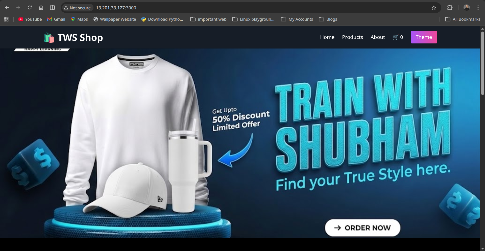
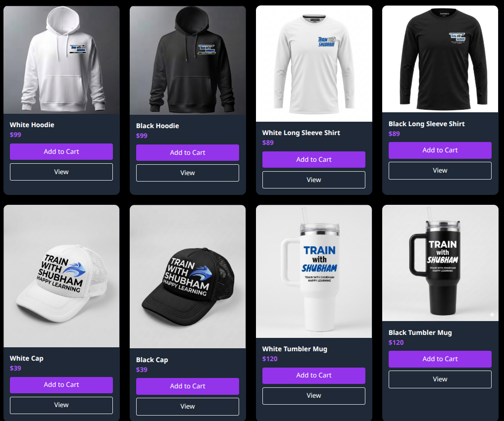
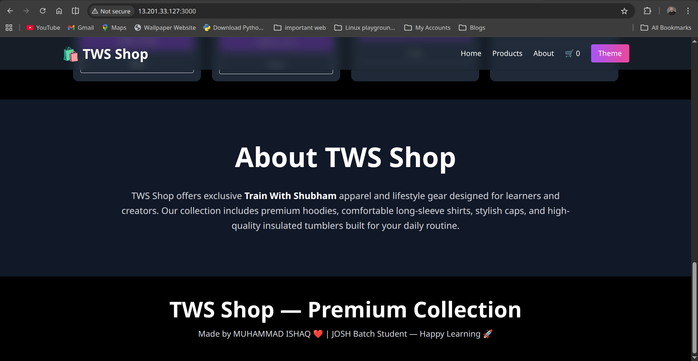
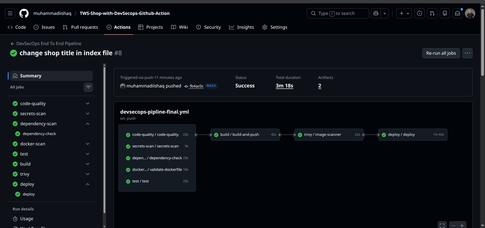

# TWS-Shop with DevSecOps Pipeline


 

## Project Overview

**TWS-Shop** is a modern, static e-commerce web application showcasing products with HTML, CSS, and JavaScript.  
This project also integrates a **full DevSecOps pipeline** using **GitHub Actions**, including:

- Code quality checks with ESLint
- Dependency vulnerability scanning (Node.js packages)
- Secrets scanning
- Dockerfile linting
- Docker image build and push
- Image scanning using Trivy
- Deployment to a server via Docker Compose

This ensures **secure code and images** are deployed to production.

---

## Project Structure

```
.
├── docker-compose.yml
├── Dockerfile
├── eslint.config.js
├── package.json
├── public
│   ├── css
│   │   └── style.css
│   ├── images
│   │   ├── black1.png
│   │   ├── black2.png
│   │   ├── black3.png
│   │   ├── black4.png
│   │   ├── favicon.png
│   │   ├── h2.png
│   │   ├── image.png
│   │   ├── product1.png
│   │   ├── product2.png
│   │   ├── product3.png
│   │   └── product4.png
│   └── js
│       ├── cart.js
│       ├── menu.js
│       └── theme.js
├── server.js
├── test
│   └── server.test.js
└── views
    ├── index.html
    └── product.html


```


- `public/` — Static assets (CSS, JS, images)  
- `views/` — HTML pages  
- `server.js` — Express server to serve pages (for local testing)  
- `test/` — Node.js test files  
- `.github/workflows/` — GitHub Actions workflows  

---

## Local Setup and Testing

### Prerequisites

- Node.js >= 18
- npm
- Docker (optional, for container testing)

### Install Dependencies

```
npm install
```
### Run Tests

```
npm test
```
You can add more tests in test/server.test.js.

### Run Locally
```
node server.js
```

Open your browser at http://localhost:3000



---

## Quick Test with Docker Image

If you want to run the app immediately without building locally, you can use the prebuilt Docker image:

### First pull images from docker-hub and run image.

```
docker pull muhammadiishaq/tws_shop:latest
docker run -dp 3000:3000 muhammadiishaq/tws_shop:latest
```
Then open `http://localhost:3000` in your browser.

### Or other way if you prefer Docker Compose:

```
docker-compose up
```

---

## DevSecOps GitHub Actions CI/CD .




**The project includes an end-to-end CI/CD pipeline defined in `.github/workflows/devsecops-pipline-final.yml`**

1. Code Quality – Runs ESLint on the project

2. Secrets Scan – Checks for accidental secrets in the code

3. Dependency Scan – Runs npm audit to detect vulnerable packages

4. Dockerfile Lint – Validates your Dockerfile

5. Build and Push Docker Image – Builds the Docker image and pushes to Docker Hub

6. Trivy Image Scan – Scans the Docker image for vulnerabilities

7. Deployment – Deploys the application to a server using Docker Compose


## Secrets Used in GitHub Actions

**The following secrets are required for the pipeline to work. You can add secret and var in repo setting.**

| Secret Name            | Description                                  |
|------------------------|----------------------------------------------|
| `EC2_SSH_HOST`         | IP or hostname of the production server      |
| `EC2_SSH_USER`         | SSH username for the production server      |
| `EC2_SSH_PRIVATE_KEY`  | Private key for SSH access to the server    |
| `DOCKERHUB_USER`       | Docker Hub username                          |
| `DOCKERHUB_TOKEN`      | Docker Hub access token or password         |

### Note.. 

These secrets are stored in GitHub repository secrets and are automatically injected into the workflows.

The DevSecOps pipeline ensures only secure and linted code/images are deployed.


## Contribution..🤝

**Contributions to this project are always welcome. You can make changes, add new features, improve existing tests, or enhance the DevSecOps workflow. If you have improvements or new ideas, simply create a pull request, and together we can build something new and exciting!**

## 👤 Author

**Muhammad Ishaq**  

Aspiring DevOps Engineer  

GitHub: https://github.com/muhammadiishaq

Linkedin: https://www.linkedin.com/in/mdiishaq/

Website: https://mdishaq.site

---

## 📄 License

This project is licensed under the MIT License.


